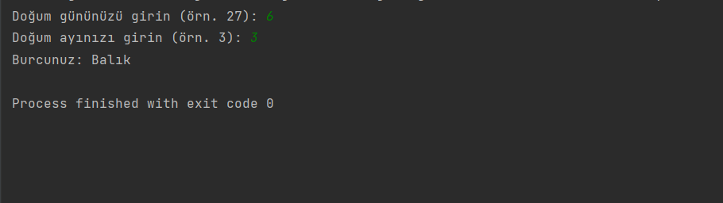

# Burç Tespiti Programı

Bu program, kullanıcının doğum tarihini alarak hangi burca ait olduğunu tespit eden bir Java programıdır.

## Kullanım

1. Programı çalıştırın.
2. Program, kullanıcıdan doğum gününü ve ayını sırasıyla girmesini isteyecektir.
3. Kullanıcı, doğru formatta doğum gününü ve ayını girerek "Enter" tuşuna basmalıdır.
4. Program, girilen doğum tarihine göre hangi burca ait olduğunu tespit edecek ve ekrana yazdıracaktır.

## Lisans

Bu proje MIT Lisansı altında lisanslanmıştır. Daha fazla bilgi için [LICENSE](LICENSE) dosyasını inceleyebilirsiniz.

## İletişim

Bana Ulaşın [anilkalay8@gmail.com]

