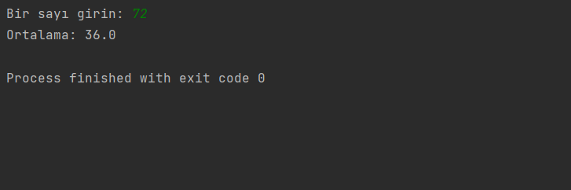

# Average Calculation

Bu program, Java döngüleri kullanarak 0'dan girilen bir sayıya kadar olan sayılardan 3 ve 4'e tam bölünen sayıların ortalamasını hesaplar.

## Kullanım

1. Programı çalıştırdığınızda, bir sayı girmeniz istenecektir.
2. Girilen sayıya kadar olan sayılar kontrol edilerek, 3 ve 4'e tam bölünebilen sayılar toplanır.
3. Eğer bu türden sayılar bulunursa, bu sayıların ortalaması hesaplanır ve ekrana yazdırılır.
4. Eğer bu türden sayılar bulunamazsa, "3 ve 4'e tam bölünen sayı bulunamadı." mesajı ekrana yazdırılır.

## Kurulum ve Çalıştırma

1. Bu projeyi klonlayın veya indirin.
2. Java çalışma ortamınızı kullanarak `AverageCalculation.java` dosyasını derleyin.
3. Derlenmiş dosyayı çalıştırın.
4. Program sizden bir sayı girmenizi isteyecektir. İstenilen sayıyı girin ve Enter tuşuna basın.
5. Program sonucu hesaplayacak ve ekrana yazdıracaktır.

## Lisans

Bu proje MIT Lisansı altında lisanslanmıştır. Detaylı bilgi için [LİSANS](LİSANS) dosyasını inceleyebilirsiniz.

## İletişim

Bana Ulaşın [anilkalay8@gmail.com]
