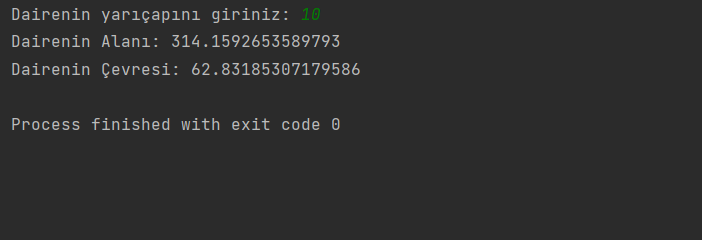

# Dairenin Alanı ve Çevresi Hesaplayan Program

Bu program, kullanıcıdan alınan yarıçap değerine göre dairenin alanını ve çevresini hesaplayan bir Java programıdır.

## Alan ve Çevre Hesaplama Formülleri

Alan Formülü: π * r * r

Çevre Formülü: 2 * π * r

## Ödev: Daire Dilimi Alanı Hesaplama

Ek olarak, programda bir ödev kısmı bulunmaktadır. Kullanıcıdan alınan yarıçap ve merkez açısının ölçüsü 𝛼 ile daire diliminin alanı hesaplanmaktadır. Formül şu şekildedir:

(𝜋 * (r * r) * 𝛼) / 360

Ödev kısmında 𝜋 (pi) sayısı 3.14 olarak alınmıştır.

## Kullanım

1. Programı çalıştırın.
2. Dairenin yarıçapını girin.
3. Program, girilen yarıçapa göre dairenin alanını ve çevresini hesaplayıp ekrana yazdıracaktır.

## Örnek

### Giriş
Dairenin yarıçapını giriniz: 5

### Çıkış
Dairenin Alanı: 78.53981633974483
Dairenin Çevresi: 31.41592653589793

---

Bu program örnektir. İstediğiniz yarıçap değerleriyle programı çalıştırarak dairenin alanını ve çevresini hesaplayabilirsiniz. Ayrıca, ödev kısmındaki daire dilimi alanı hesaplama formülünü de uygulayabilirsiniz.

## İletişim

Bana Ulaşın [anilkalay8@gmail.com]

## Lisans

Bu proje MIT Lisansı altında lisanslanmıştır. Detaylı lisans metni için [LICENSE](LICENSE) dosyasını inceleyebilirsiniz.
