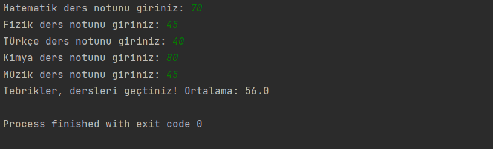

# Geçme Kalma Projesi

Bu proje, kullanıcının Matematik, Fizik, Türkçe, Kimya ve Müzik derslerinin notlarını alarak ortalama hesaplamakta ve geçme durumunu kontrol etmektedir.

## Kullanım

1. Programı çalıştırın.
2. Her ders için, istenen notu girin.
3. Girilen notlar 0 ile 100 arasında ise, ortalama hesaplamasına dahil edilecektir.
4. Program, girilen notlara göre ortalama hesaplayacak ve geçme durumunu kontrol edecektir.
5. Geçme notunu aşan bir ortalama elde edilirse, "Tebrikler, dersleri geçtiniz!" mesajı görüntülenecektir. Aksi takdirde, "Maalesef, dersleri geçemediniz." mesajı görüntülenecektir.

## Lisans

Bu proje MIT Lisansı altında lisanslanmıştır. Daha fazla bilgi için [LICENSE](LICENSE) dosyasını inceleyebilirsiniz.

## İletişim

Bana Ulaşın [anilkalay8@gmail.com]

