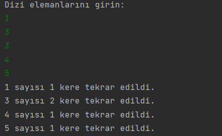

# Frekans Bulucu

Kullanıcıdan aldığı dizi hakkında bilgi verir

## Kullanım

1. Program çalıştırıldığında, kullanıcıdan bir dizi boyutu istenir. Bu boyut, dizinin kaç elemandan oluşacağını belirler.
2. Daha sonra kullanıcı, dizinin elemanlarını girer.
3. Program, dizideki elemanların frekanslarını hesaplar ve sonuçları ekrana yazdırır.

## Lisans

Bu proje MIT Lisansı altında lisanslanmıştır - detaylar için [LICENSE](LICENSE) dosyasına bakın.

## İletişim

Bana Ulaşın [anilkalay8@gmail.com]

