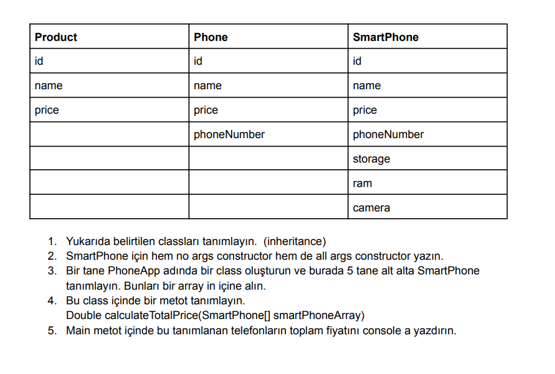

# GARANTİ BBVA HOMEWORKS

# TELEFON UYGULAMASI

## Açıklama

Bu Java projesi, telefonlar ve akıllı telefonların temel özelliklerini temsil eden sınıfları içerir.

## Sınıflar

1. `Product`: Bir ürünün temel özelliklerini (id, name, price) içerir.
2. `Phone`: `Product` sınıfını alır ve `phoneNumber` ekstra özelliğini içerir.
3. `SmartPhone`: `Phone` sınıfını alır ve stroge, ram , camera ekler.

## Main Metodu

`PhoneApp` sınıfının `main` metodu, örnek telefon nesneleri oluşturur ve toplam fiyatı hesaplar.

## Kullanım

Java programını çalıştırarak, örnek telefonların toplam fiyatını ekrana yazdırabilirsiniz.
