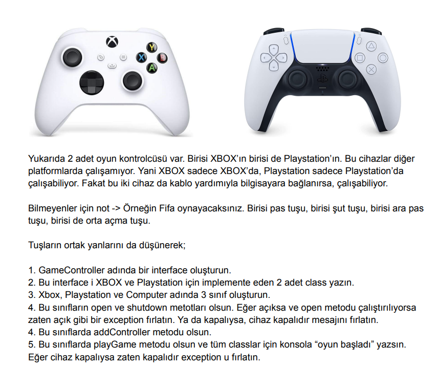

# Oyun Kontrolcüsü Projesi

Bu proje, farklı oyun kontrolcüleri ve bilgisayar arasındaki etkileşimi simüle eder. Projede Xbox, Playstation ve Computer olmak üzere 3 farklı cihaz sınıfı bulunmaktadır. Her bir cihaz, GameController arayüzünü implemente etmektedir.

## GameController Arayüzü

`GameController` arayüzü, farklı oyun kontrolcülerinin ortak metodlarını tanımlamaktadır. Bu arayüz, her oyun kontrolcüsünde bulunması gereken temel fonksiyonları içerir.

## Xbox Sınıfı

`Xbox` sınıfı, GameController arayüzünü implemente eden ve Xbox oyun konsolunu temsil eden sınıftır.

## Playstation Sınıfı

`Playstation` sınıfı, GameController arayüzünü implemente eden ve Playstation oyun konsolunu temsil eden sınıftır.

## Computer Sınıfı

`Computer` sınıfı, GameController arayüzünü implemente eden ve bilgisayarı temsil eden sınıftır.

## Lisans

Bu proje, MIT Lisansı ile lisanslanmıştır. Daha fazla bilgi için [LICENSE](./LICENSE) dosyasını inceleyebilirsiniz.

## İletişim

Bana Ulaşın [anilkalay8@gmail.com]

