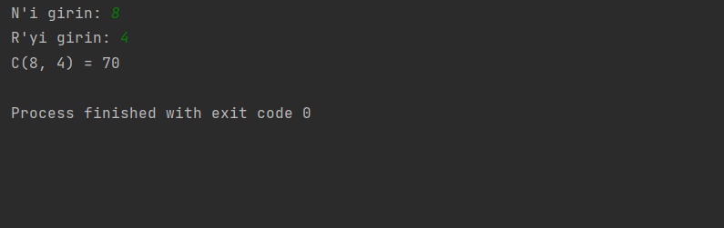

# Kombinasyon Hesaplayan Program

Bu program, kullanıcının girdiği N ve R değerleriyle kombinasyon hesaplamasını gerçekleştiren bir Java programıdır.

## Kullanım

1. Programı çalıştırın.
2.  "N'i girin: " mesajıyla karşılaşacaksınız.
3.  "R'yi girin: " mesajıyla karşılaşacaksınız. 
4. Program, hesaplanan kombinasyon sonucunu ekrana yazdıracaktır.

## Kombinasyon Formülü

Kombinasyon hesaplama formülü aşağıdaki gibi tanımlanır:

C(n,r) = n! / (r! * (n-r)!)

## Lisans

Bu proje MIT Lisansı altında lisanslanmıştır. Daha fazla bilgi için [Lisans Dosyası](LICENSE) dosyasına başvurabilirsiniz.

## İletişim

Bana Ulaşın [anilkalay8@gmail.com]
