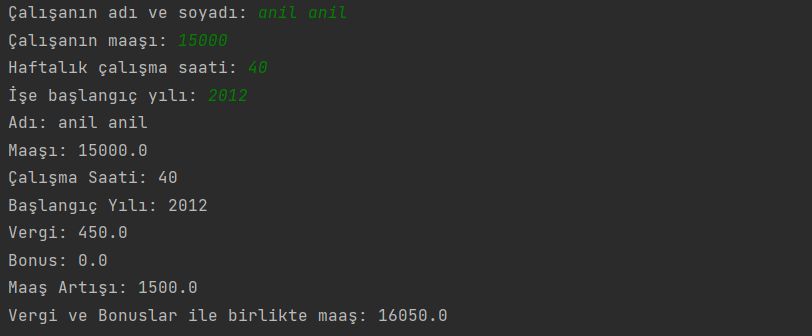

# Employee Sınıfı

`Employee` sınıfı, Java'da bir fabrika çalışanını temsil etmek için kullanılır. Çalışanın adı, maaşı, çalışma saatleri ve işe başlama yılı gibi özellikleri içerir. Ayrıca, çalışanın maaşını hesaplamak için metotlar sunar.

## Sınıf Nitelikleri

- `name`: Çalışanın adı
- `salary`: Çalışanın maaşı
- `workHours`: Haftalık çalışma saatleri
- `hireYear`: İşe başlama yılı

Girilen veriler doğrultusunda çalışanın aktif maaşını terminalde görebilirsiniz.

## Lisans

Bu proje MIT Lisansı altında lisanslanmıştır. Daha fazla bilgi için [Lisans Dosyası](LICENSE) dosyasına başvurabilirsiniz.

## İletişim

Bana Ulaşın [anilkalay8@gmail.com]
