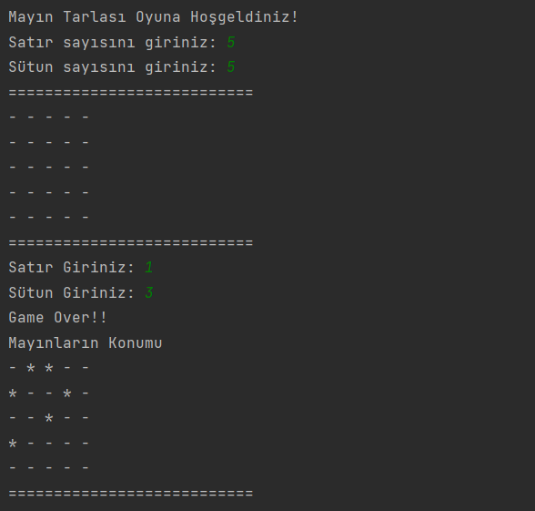

# Mayın Tarlası Oyunu

Bu Java projesi, metin tabanlı bir Mayın Tarlası oyununu temsil eder. Oyun, kullanıcının matris üzerinde mayınları tahmin ederek tüm güvenli alanları bulmaya çalıştığı basit bir oyundur.

## Oyun Kuralları

- Oyun metin tabanlıdır ve çift boyutlu diziler üzerinde oynanır.
- Matris boyutu (satır ve sütun sayısı) kullanıcı tarafından belirlenir.
- Mayınların yerleştirildiği matris rastgele oluşturulur.
- Kullanıcı tüm güvenli alanları seçerek oyunu kazanır.

## İletişim

Bana ulaşın [anilkalay8@gmail.com]

## Lisans

Bu proje MIT Lisansı altında lisanslanmıştır. Detaylı bilgi için [MIT Lisansı](https://opensource.org/licenses/MIT) dosyasını inceleyebilirsiniz.

