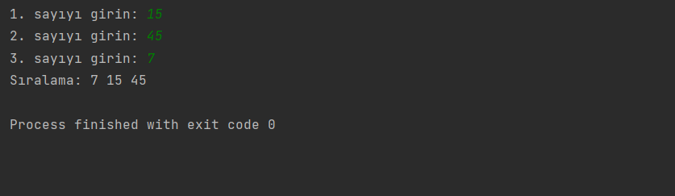

# Sayı Sıralama Programı

Bu program, kullanıcıdan alınan 3 sayıyı küçükten büyüğe sıralayan bir Java programıdır.

## Kullanım

1. Programı çalıştırın.
2. Program, kullanıcıdan 3 sayı girmesini isteyecektir.
3. Kullanıcı, 3 sayıyı sırasıyla girerek "Enter" tuşuna basmalıdır.
4. Program, girilen 3 sayıyı küçükten büyüğe sıralayacak ve sıralanmış sayıları ekrana yazdıracaktır.

## Lisans

Bu proje MIT Lisansı altında lisanslanmıştır. Daha fazla bilgi için [LICENSE](LICENSE) dosyasını inceleyebilirsiniz.

## İletişim

Bana Ulaşın [anilkalay8@gmail.com]

