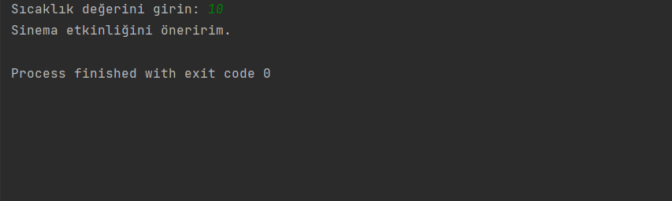

# Hava Durumu ve Etkinlik Önerisi Programı

Bu program, kullanıcının girilen sıcaklık değerine göre farklı etkinlikler önermektedir.

## Kullanım

1. Programı çalıştırın.
2. Program, kullanıcıdan sıcaklık değerini girmesini isteyecektir.
3. Program, girilen sıcaklık değerine göre uygun bir etkinlik önerisinde bulunacaktır.

## Koşullar ve Etkinlikler

- Sıcaklık 5'den küçük ise "Kayak" yapmayı önerir.
- Sıcaklık 5 ve 15 arasında ise "Sinema" etkinliğini önerir.
- Sıcaklık 15 ve 25 arasında ise "Piknik" etkinliğini önerir.
- Sıcaklık 25'ten büyük ise "Yüzme" etkinliğini önerir.

## Lisans

Bana Ulaşın [anilkalay8@gmail.com]
## İletişim

Herhangi bir sorunuz veya geri bildiriminiz varsa, lütfen [email@example.com](mailto:email@example.com) adresine e-posta gönderin veya [proje sayfasını](https://github.com/kullanici/proje) ziyaret edin.

