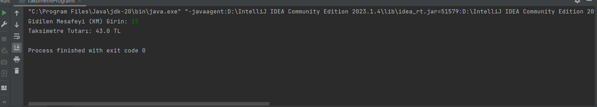

# Taksimetre Uygulaması

Bu uygulama, Java programıyla gidilen mesafeye göre taksimetre tutarını hesaplar.

## Kullanım

1. Program çalıştırıldığında, kullanıcıdan gidilen mesafeyi (KM cinsinden) girmesi istenir.
2. Gidilen mesafe bilgisini girin ve enter tuşuna basın.
3. Program, taksimetre tutarını hesaplar ve ekrana yazdırır.

## Kurulum

1. Bu projeyi klonlayın veya indirin.
2. `taksi.png` dosyasını projenin ana dizinine ekleyin.

## Örnek

### Girdi

## Katkıda Bulunma

Katkıda Bulunabilirsiniz
## Lisans

Bu proje [MIT Lisansı](LICENSE) ile lisanslanmıştır. Daha fazla bilgi için lisans dosyasını inceleyin.

## İletişim

Bana Ulaşın

- E-posta: anilkalay8@gmail.com

