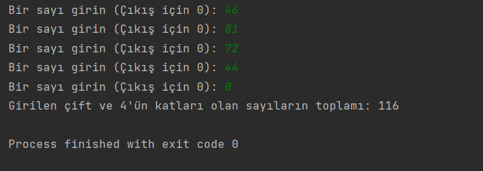

# Number Sum

Bu program, Java döngüleri kullanarak tek bir sayı girilene kadar kullanıcıdan girişleri kabul eder ve girilen değerlerden çift ve 4'ün katları olan sayıları toplayıp ekrana basar.

## Kullanım

1. Programı çalıştırdığınızda, bir sayı girmeniz istenecektir.
2. Girişleri kabul etmek için, istenen sayıları girin ve Enter tuşuna basın.
6. Sıfır (0) girildiğinde, toplam değeri ekrana yazdırır ve program sonlanır.

## Kurulum ve Çalıştırma

1. Bu projeyi klonlayın veya indirin.
2. Java çalışma ortamınızı kullanarak `NumberSum.java` dosyasını derleyin.

## Lisans

Bu proje MIT Lisansı altında lisanslanmıştır. Detaylı bilgi için [LİSANS](LİSANS) dosyasını inceleyebilirsiniz.

## İletişim

Bana Ulaşın [anilkalay8@gmail.com]

