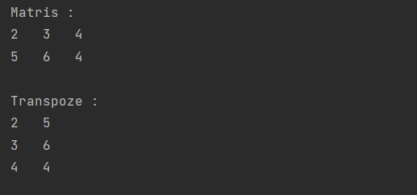

# Matris Transpozisyonu Programı

Bu Java projesi, çok boyutlu diziler kullanarak bir matrisin transpozunu (devriğini) hesaplamak için tasarlanmıştır.



## Örnek Kullanım

```java
public class MatrixTransposition {
    public static void main(String[] args) {
        int[][] matrix = {
            {2, 3, 4},
            {5, 6, 4}
        };
        
        int[][] transpose = transposeMatrix(matrix);
        
        System.out.println("Matris :");
        printMatrix(matrix);
        
        System.out.println("Transpoze :");
        printMatrix(transpose);
    }

    // ...
}

