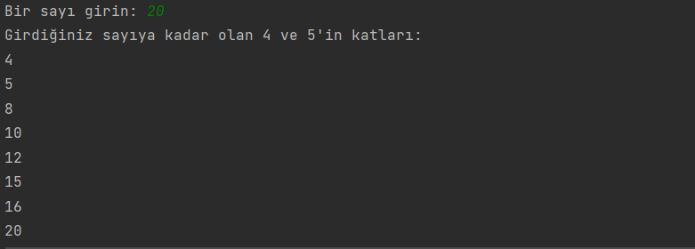

# PowerOfNumbers Programı

Bu program, kullanıcının girdiği bir sayıya kadar olan 4 ve 5'in katlarını ekrana yazdıran bir Java programıdır.

## Nasıl Çalışır?

1. Program çalıştırıldığında, kullanıcıdan bir sayı girmesi istenir.
2. Kullanıcı bir sayı girdiğinde, program girilen sayıya kadar olan sayılardan 4 veya 5'in katı olanları bulur.
3. Bulunan bu sayılar ekrana yazdırılır.

## Kullanım

1. Programı çalıştırın.
2. Bir sayı girin ve enter tuşuna basın.
3. Program, girilen sayıya kadar olan 4 ve 5'in katlarını bulup ekrana yazdıracaktır.

## Lisans

Bu proje MIT Lisansı altında lisanslanmıştır. Detaylı bilgi için [LİSANS](LİSANS) dosyasını inceleyebilirsiniz.

## İletişim: 
Bana Ulaşın [anilkalay8@gmail.com]

