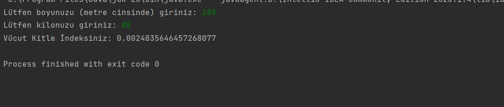

# Vücut Kitle İndeksi Hesaplama Programı

Bu program, kullanıcıdan alınan boy ve kilo değerlerine göre "Vücut Kitle İndeksi"ni hesaplar.

## Kullanım

1. Program çalıştırıldığında, kullanıcıdan boyunu (metre cinsinde) girmesi istenir.
2. Boy değerini girin ve enter tuşuna basın.
3. Program, kullanıcıdan kilosunu girilmesini ister.
4. Kilo değerini girin ve enter tuşuna basın.
5. Program, verilen boy ve kilo değerlerine göre "Vücut Kitle İndeksi"ni hesaplar.
6. Hesaplanan değer ekrana yazdırılır.

## Lisans

Bu proje [MIT Lisansı](LICENSE) ile lisanslanmıştır. Daha fazla bilgi için lisans dosyasını inceleyin.

## İletişim

Bana Ulaşın

- E-posta: anilkalay8@gmail.com
