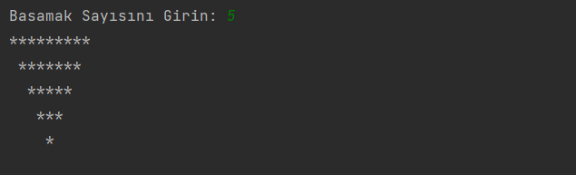

# Ters Üçgen Çizme Programı

Bu program, kullanıcının girdiği basamak sayısına göre ters üçgen çizen bir Java programıdır.

## Kullanım

1. Programı çalıştırın.
2. Bir basamak sayısı girin.
3. Program, girilen basamak sayısına göre ters üçgeni ekranda çizecektir.

## İletişim
Bana ulaşın [anilkalay8@gmail.com]

## Lisans

Bu proje MIT Lisansı altında lisanslanmıştır. Detaylı lisans metni için [LICENSE](LICENSE) dosyasını inceleyebilirsiniz.

---

Bu program örnektir. Ters üçgenin şekli ve boyutu değiştirilebilir veya özelleştirilebilir.

