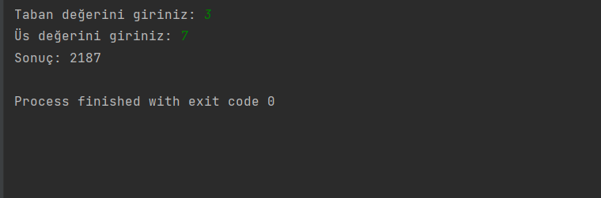

# Recursive Us Alma Programı

Bu program, kullanıcının girdiği taban ve üs değerlerini kullanarak üs alma işlemini recursive (özyinelemeli) bir metot kullanarak gerçekleştirir.

## Kullanım

1. Programı çalıştırın.
2. Taban değerini girin.
3. Üs değerini girin.
4. Program, girilen taban ve üs değerlerine göre üs alma işlemini gerçekleştirir ve sonucu ekranda gösterir.

## Örnek

### Giriş
Taban değerini giriniz: 2
Üs değerini giriniz: 3

### Çıkış
Sonuç: 8

---

Bu program örnektir. Taban ve üs değerleri değiştirilebilir veya özelleştirilebilir.

## İletişim

Bana Ulaşın [anilkalay8@gmail.com]

## Lisans

Bu proje MIT Lisansı altında lisanslanmıştır. Detaylı lisans metni için [LICENSE](LICENSE) dosyasını inceleyebilirsiniz.
